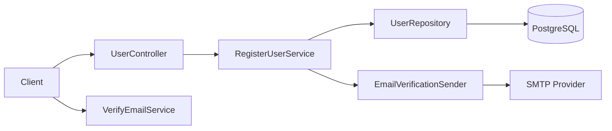

# TechSpec: User Registration

| Field | Value |
|-------|-------|
| Status | Approved |
| Author | John Smith |
| Date | 2026-09-03 |
| PRD | [1-PRD.md](./1-PRD.md) |

## 1. Overview

REST API for registration with email verification. The account is persisted as `PendingVerification` and activated after confirming a single-use token sent by email. Email sending is asynchronous to keep the registration endpoint fast. Token strategy is defined in [ADR-001](./adrs/001-email-verification-token-strategy.md).

## 2. Architecture



## 3. Components

| Component | Responsibility | Type |
|-----------|----------------|------|
| UserController | Expose registration and verification endpoints, validate input at the boundary | New |
| RegisterUserService | Orchestrate registration: uniqueness check, persistence, token issuance | New |
| VerifyEmailService | Validate token and activate the account | New |
| User | Domain entity with state and password policy invariants | New |
| UserRepository | Persistence of users and verification tokens | New |
| EmailVerificationSender | Send verification email asynchronously | New |

## 4. Data Model

### Entities

| Entity | Field | Type | Constraints |
|--------|-------|------|-------------|
| User | id | uuid | primary key |
| User | name | varchar(100) | required |
| User | email | varchar(255) | required, unique, indexed |
| User | password_hash | varchar(60) | required |
| User | status | varchar(20) | required: PendingVerification, Active |
| User | created_at | timestamp | required |
| EmailVerificationToken | token_hash | varchar(64) | primary key, SHA-256 of the raw token |
| EmailVerificationToken | user_id | uuid | foreign key, indexed |
| EmailVerificationToken | expires_at | timestamp | required |

### Migrations

- `V1__create_users.sql` and `V2__create_email_verification_tokens.sql`; rollback by dropping tables since no previous data exists.

## 5. API Contracts

### POST /users

- Purpose: register a new account
- Authorization: anonymous, rate limited

Request:

```json
{ "name": "Jane Doe", "email": "jane@example.com", "password": "correct-horse-battery" }
```

Response `201`:

```json
{ "id": "3f1c...", "status": "PendingVerification" }
```

Errors:

| Status | Condition |
|--------|-----------|
| 400 | Invalid name, email format, or password policy violation |
| 409 | Email already registered |

### POST /email-verifications

- Purpose: confirm the verification token and activate the account
- Authorization: anonymous, rate limited

Request:

```json
{ "token": "raw-token-from-email" }
```

Response `200`:

```json
{ "status": "Active" }
```

Errors:

| Status | Condition |
|--------|-----------|
| 400 | Malformed token |
| 404 | Token not found, expired, or already used |

### POST /email-verification-requests

- Purpose: resend the verification email, invalidating previous tokens
- Authorization: anonymous, rate limited

Request:

```json
{ "email": "jane@example.com" }
```

Response `202`: empty body, returned even if the email does not exist, to prevent enumeration.

## 6. Business Rules

| ID | Rule | Source |
|----|------|--------|
| BR-01 | Email is unique across all accounts, compared case-insensitively | FR-03 |
| BR-02 | Password must have at least 12 characters, including one letter and one number | FR-04 |
| BR-03 | Verification token expires in 24 hours and is single use | FR-02 |
| BR-04 | Account starts as PendingVerification and only becomes Active after verification | FR-02 |
| BR-05 | Requesting a resend invalidates all previous tokens for that user | FR-05 |

## 7. Requirement Traceability

| PRD Requirement | Technical Solution |
|-----------------|--------------------|
| FR-01 | POST /users, RegisterUserService, User entity |
| FR-02 | POST /email-verifications, VerifyEmailService, BR-03, BR-04 |
| FR-03 | BR-01, unique index on users.email |
| FR-04 | BR-02 enforced in the User entity |
| FR-05 | POST /email-verification-requests, BR-05 |
| NFR-01 | Async email sending, indexed lookups |
| NFR-02 | bcrypt hashing, TLS termination, rate limiting middleware |
| NFR-03 | Stateless API behind existing load balancer; readiness and liveness health checks for rolling deployment |
| NFR-04 | Structured logs, registration counters, verification failure alert |

## 8. Alternatives Considered

| Alternative | Pros | Cons | Decision |
|-------------|------|------|----------|
| Random token stored hashed ([ADR-001](./adrs/001-email-verification-token-strategy.md)) | Revocable, single-use enforcement, no secret rotation | Requires database lookup | Chosen |
| Signed JWT verification token | Stateless, no storage | Not revocable before expiry, breaks BR-05 | Rejected: resend must invalidate previous tokens |
| Synchronous email sending | Simpler flow | Couples registration latency to SMTP provider | Rejected: violates NFR-01 |

## 9. Security

- Authentication: endpoints are anonymous by design; activation requires possession of the emailed token.
- Authorization: rate limiting of 5 requests per minute per IP on all three endpoints.
- Input validation: request models validated at the controller boundary; domain invariants enforced in the User entity.
- Sensitive data: passwords hashed with bcrypt (cost 12); raw tokens never persisted, only SHA-256 hashes; logs never contain passwords or tokens.

## 10. Observability

- Logs: structured log per registration, verification success, and verification failure, with correlation id.
- Metrics: counters for registrations, verifications, expired tokens, and resends.
- Alerts: verification failure rate above 20% in 15 minutes.

## 11. Performance

- Expected load: 50 registrations per minute at peak.
- Strategy: unique index on users.email for the duplicate check; async email dispatch; indexed token lookup by hash.

## 12. Testing Strategy

| Level | Scope | Tooling |
|-------|-------|---------|
| Unit | User invariants, services, business rules BR-01 to BR-05 | JUnit, Mockito |
| Integration | Endpoints, repository, migrations | Spring Boot Test, Testcontainers |
| End To End | Register, verify, resend flows | REST Assured |

## 13. Rollout

- Feature flag: yes, `user-registration-enabled`.
- Deployment order: run migrations, deploy API with flag off through rolling deployment gated by readiness health checks, enable flag in staging, validate, enable in production.
- Rollback plan: disable the flag; no destructive migration involved.

## 14. Risks

| Risk | Probability | Impact | Mitigation |
|------|-------------|--------|------------|
| SMTP provider delays or drops emails | Medium | High | Resend endpoint, delivery metrics, alert on failure spike |
| Registration abuse by bots | Medium | Medium | Rate limiting per IP, enumeration-safe responses |

## 15. Open Questions

| # | Question | Owner | Resolution |
|---|----------|-------|------------|
| 1 | Should resend be limited per user per day? | John Smith | Resolved: covered by the global rate limit, revisit after launch metrics |

## 16. Approval

| Role | Name | Decision | Date |
|------|------|----------|------|
| Tech Lead | John Smith | Approved | 2026-09-04 |
| Architecture | Alice Brown | Approved | 2026-09-04 |
