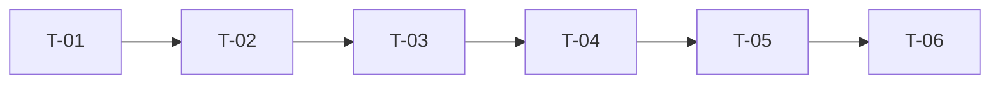

# Plan: User Registration

| Field | Value |
|-------|-------|
| Status | Approved |
| Author | John Smith |
| Date | 2026-09-04 |
| TechSpec | [2-TECHSPEC.md](./2-TECHSPEC.md) |

## 1. Strategy

Two milestones, each delivering a working increment. M1 delivers registration end to end behind the feature flag; M2 delivers the verification flow and hardening. Tasks are vertical slices: each one includes implementation and tests.

## 2. Milestones

| Milestone | Deliverable | Tasks |
|-----------|-------------|-------|
| M1 | Account registration persisted with policy enforcement | T-01, T-02, T-03 |
| M2 | Email verification, resend, and hardening | T-04, T-05, T-06 |

## 3. Tasks

### T-01: User domain entity and password policy

- Description: create the `User` entity with status transitions and password policy invariant, plus password hashing port
- Traceability: FR-01, FR-04 / BR-02, BR-04
- Files: `domain/User.java`, `domain/PasswordPolicy.java`, `domain/PasswordHasher.java`, tests
- Depends on: none
- Definition of done:
  - [ ] Invalid password rejected with clear domain error
  - [ ] Unit tests covering all scenarios
  - [ ] No lint or build errors

### T-02: Persistence and migrations

- Description: create `UserRepository`, `EmailVerificationToken` storage, and migrations with unique email index
- Traceability: FR-03 / BR-01
- Files: `infrastructure/UserRepositoryImpl.java`, `db/migration/V1__create_users.sql`, `db/migration/V2__create_email_verification_tokens.sql`, tests
- Depends on: T-01
- Definition of done:
  - [ ] Duplicate email rejected by unique index, case-insensitive
  - [ ] Integration tests with Testcontainers passing
  - [ ] No lint or build errors

### T-03: Registration service and endpoint

- Description: implement `RegisterUserService` and `POST /users` with boundary validation and 201/400/409 responses
- Traceability: FR-01, FR-03 / BR-01, BR-02
- Files: `application/RegisterUserService.java`, `api/UserController.java`, `api/RegisterUserRequest.java`, tests
- Depends on: T-02
- Definition of done:
  - [ ] Valid registration persists PendingVerification account
  - [ ] Unit and integration tests covering all scenarios
  - [ ] No lint or build errors

### T-04: Token issuance and async email sending

- Description: implement token generation per [ADR-001](./adrs/001-email-verification-token-strategy.md) and `EmailVerificationSender` with async dispatch
- Traceability: FR-02 / BR-03
- Files: `application/VerificationTokenIssuer.java`, `infrastructure/SmtpEmailVerificationSender.java`, tests
- Depends on: T-03
- Definition of done:
  - [ ] Only the token hash is persisted, raw token only in the email
  - [ ] Registration latency independent from SMTP call
  - [ ] Unit tests covering all scenarios
  - [ ] No lint or build errors

### T-05: Verification and resend endpoints

- Description: implement `VerifyEmailService`, `POST /email-verifications`, and `POST /email-verification-requests` with enumeration-safe responses
- Traceability: FR-02, FR-05 / BR-03, BR-04, BR-05
- Files: `application/VerifyEmailService.java`, `application/ResendVerificationService.java`, `api/UserController.java`, tests
- Depends on: T-04
- Definition of done:
  - [ ] Valid token activates account; expired or reused token returns 404
  - [ ] Resend invalidates previous tokens
  - [ ] Unit and integration tests covering all scenarios
  - [ ] No lint or build errors

### T-06: Rate limiting, observability, and end-to-end tests

- Description: apply rate limiting to the three endpoints, add logs, metrics, alert rule, feature flag wiring, and end-to-end flow tests
- Traceability: NFR-01, NFR-02, NFR-04
- Files: `infrastructure/RateLimitingFilter.java`, `infrastructure/RegistrationMetrics.java`, `e2e/RegistrationFlowTest.java`, config
- Depends on: T-05
- Definition of done:
  - [ ] 6th request in a minute from the same IP returns 429
  - [ ] Metrics and logs emitted for all flows
  - [ ] End-to-end register, verify, and resend flows passing
  - [ ] No lint or build errors

## 4. Task Order

## 5. Coverage Check

| TechSpec Item | Covered By |
|---------------|------------|
| User entity | T-01 |
| UserRepository and migrations | T-02 |
| RegisterUserService and POST /users | T-03 |
| EmailVerificationSender and token issuance | T-04 |
| VerifyEmailService and verification endpoints | T-05 |
| Rate limiting, observability, feature flag | T-06 |

Every TechSpec component must map to at least one task. No task may exist without traceability.

## 6. Out Of Plan

- Cleanup job for expired tokens: deferred to backlog, low volume at launch does not justify it.

## 7. Approval

| Role | Name | Decision | Date |
|------|------|----------|------|
| Tech Lead | John Smith | Approved | 2026-09-05 |
