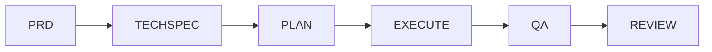

# Spec Driven Development (SDD)

Workflow template for developing any feature through sequential, verifiable phases. Each phase produces an artifact that is the input for the next phase.

## Workflow



| Phase | Artifact | Purpose | Agent | Approval Gate |
|-------|----------|---------|-------|---------------|
| 1. PRD | `1-PRD.md` | Define WHAT and WHY | Business Analyst | Product approval |
| 2. TechSpec | `2-TECHSPEC.md` | Define HOW | Software Architect | Tech Lead and Architecture approval |
| 3. Plan | `3-PLAN.md` | Break down into executable tasks | Developer | Tech Lead approval |
| 4. Execute | `4-EXECUTE.md` | Implement tasks and log progress | Developer | All tasks done and completion checklist verified |
| 5. QA | `5-QA.md` | Validate against PRD and TechSpec | QA | All verdict checks pass |
| 6. Review | `6-REVIEW.md` | Final review and retrospective | Reviewer | Reviewer, Tech Lead, and Product sign-off |

## How To Use

1. Create a folder for the feature: `features/<feature-name>/`.
2. Copy all templates from `templates/` into the feature folder.
3. Fill each template in order, replacing every `{PLACEHOLDER}`.
4. Do not start a phase before the previous one is approved.
5. If a later phase invalidates an earlier decision, update the earlier artifact first, then continue.

See [features/user-registration/](features/user-registration/) for a complete filled example of all phases, including an ADR.

## AI Agents (VS Code)

Each phase is owned by a custom agent in `.github/agents/`. The agent holds the rules and the approval gate of its phase and hands off to the next agent when its artifact is ready. All agents follow the repository rules linked from [AGENTS.md](AGENTS.md).

VS Code discovers `AGENTS.md`, `.agents/`, and `.github/` only at the workspace root. Open this folder as the workspace, or copy those three items to the root of the target repository.

| Agent | File | Phases | Hands off to |
|-------|------|--------|--------------|
| Business Analyst | `business-analyst.agent.md` | 1. PRD | Software Architect |
| Software Architect | `software-architect.agent.md` | 2. TechSpec | Developer |
| Developer | `developer.agent.md` | 3. Plan, 4. Execute | QA |
| QA | `qa.agent.md` | 5. QA | Reviewer, or Developer on failure |
| Reviewer | `reviewer.agent.md` | 6. Review | Developer on request changes |


Every agent also works in standalone mode for requests outside a feature folder, applying the same rigor without producing SDD artifacts.

## AI Prompts (VS Code)

Each phase has a prompt file in `.github/prompts/` that runs it with the phase agent. Type `/` in chat and run the phases in order:

| Command | Phase | Agent | Input |
|---------|-------|-------|-------|
| `/sdd-1-prd` | Generate PRD | Business Analyst | Feature name and problem description |
| `/sdd-2-techspec` | Generate TechSpec | Software Architect | Feature folder name |
| `/sdd-3-plan` | Generate Plan | Developer | Feature folder name |
| `/sdd-4-execute` | Execute tasks one by one | Developer | Feature folder name |
| `/sdd-5-qa` | Validate against PRD and TechSpec | QA | Feature folder name |
| `/sdd-6-review` | Final review and sign-off | Reviewer | Feature folder name |

The prompts only trigger the phase; the agent enforces the gate and stops if the previous artifact is missing or not approved.

## ADR (Architecture Decision Record)

Use [templates/ADR.md](templates/ADR.md) for technical decisions with long-term impact that deserve a standalone record (e.g., token strategy, storage choice, protocol). Store them in `features/<feature-name>/adrs/NNN-title.md` and reference them from the TechSpec Alternatives section. One decision per ADR. ADRs start as `Proposed` and become `Accepted` when the TechSpec is approved.

## Rules

- One feature per folder. One artifact per phase.
- Every requirement must be traceable: PRD → TechSpec → Plan → Execute → QA → Review.
- Every FR, NFR, and BR must map to at least one plan task or appear in Out Of Plan with a reason.
- Every FR, US, and NFR must appear in the QA validation tables with evidence.
- Commits are suggested per task and created only when explicitly requested.
- Keep artifacts short, objective, and in English.
- Mark unresolved points as `OPEN QUESTION` and resolve them before approval.
- Update the artifact status header at every transition: `Draft → In Review → Approved → Done`.

## Structure

```
SDD/
├── readme.md
├── AGENTS.md
├── .agents/
│   ├── rules/
│   │   ├── role.md
│   │   ├── principles.md
│   │   ├── code-style.md
│   │   ├── dependencies.md
│   │   ├── dependency-injection.md
│   │   ├── testability.md
│   │   ├── performance.md
│   │   ├── api-design.md
│   │   ├── java.md
│   │   ├── anti-patterns.md
│   │   └── output.md
│   └── skills/
│       └── example/
│           └── SKILL.md
├── .github/
│   ├── agents/
│   │   ├── business-analyst.agent.md
│   │   ├── software-architect.agent.md
│   │   ├── developer.agent.md
│   │   ├── qa.agent.md
│   │   └── reviewer.agent.md
│   └── prompts/
│       ├── sdd-1-prd.prompt.md
│       ├── sdd-2-techspec.prompt.md
│       ├── sdd-3-plan.prompt.md
│       ├── sdd-4-execute.prompt.md
│       ├── sdd-5-qa.prompt.md
│       └── sdd-6-review.prompt.md
├── templates/
│   ├── 1-PRD.md
│   ├── 2-TECHSPEC.md
│   ├── 3-PLAN.md
│   ├── 4-EXECUTE.md
│   ├── 5-QA.md
│   ├── 6-REVIEW.md
│   └── ADR.md
└── features/
    └── <feature-name>/
        ├── 1-PRD.md
        ├── 2-TECHSPEC.md
        ├── 3-PLAN.md
        ├── 4-EXECUTE.md
        ├── 5-QA.md
        ├── 6-REVIEW.md
        └── adrs/
            └── NNN-title.md
```

The folder `features/user-registration/` contains a complete example with every artifact filled.
