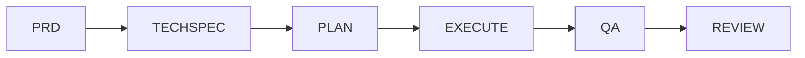

# Spec Driven Development (SDD)

Workflow template for developing any feature through sequential, verifiable phases. Each phase produces an artifact that is the input for the next phase.

## Workflow



| Phase | Artifact | Purpose | Approval Gate |
|-------|----------|---------|---------------|
| 1. PRD | `1-PRD.md` | Define WHAT and WHY | Product approval |
| 2. TechSpec | `2-TECHSPEC.md` | Define HOW | Technical approval |
| 3. Plan | `3-PLAN.md` | Break down into executable tasks | Plan approval |
| 4. Execute | `4-EXECUTE.md` | Implement tasks and log progress | All tasks done |
| 5. QA | `5-QA.md` | Validate against PRD and TechSpec | All checks pass |
| 6. Review | `6-REVIEW.md` | Final review and retrospective | Sign-off |

## How To Use

1. Create a folder for the feature: `features/<feature-name>/`.
2. Copy all templates from `templates/` into the feature folder.
3. Fill each template in order, replacing every `{PLACEHOLDER}`.
4. Do not start a phase before the previous one is approved.
5. If a later phase invalidates an earlier decision, update the earlier artifact first, then continue.

See [features/user-registration/](features/user-registration/) for a complete filled example of all phases, including an ADR.

## AI Prompts (VS Code)

Each phase has a prompt file in `.github/prompts/` that automates it with Copilot. Type `/` in chat and run the phases in order:

| Command | Phase | Input |
|---------|-------|-------|
| `/sdd-1-prd` | Generate PRD | Feature name and problem description |
| `/sdd-2-techspec` | Generate TechSpec | Feature folder name |
| `/sdd-3-plan` | Generate Plan | Feature folder name |
| `/sdd-4-execute` | Execute tasks one by one | Feature folder name |
| `/sdd-5-qa` | Validate against PRD and TechSpec | Feature folder name |
| `/sdd-6-review` | Final review and sign-off | Feature folder name |

Each prompt enforces the phase gate: it stops if the previous artifact is missing or not approved.

## ADR (Architecture Decision Record)

Use [templates/ADR.md](templates/ADR.md) for technical decisions with long-term impact that deserve a standalone record (e.g., token strategy, storage choice, protocol). Store them in `features/<feature-name>/adrs/NNN-title.md` and reference them from the TechSpec Alternatives section. One decision per ADR.

## Rules

- One feature per folder. One artifact per phase.
- Every requirement must be traceable: PRD → TechSpec → Plan → Execute → QA.
- Keep artifacts short, objective, and in English.
- Mark unresolved points as `OPEN QUESTION` and resolve them before approval.
- Update the artifact status header at every transition: `Draft → In Review → Approved → Done`.

## Structure

```
SDD/
├── README.md
├── .github/
│   └── prompts/
│       ├── sdd-1-prd.prompt.md
│       ├── sdd-2-techspec.prompt.md
│       ├── sdd-3-plan.prompt.md
│       ├── sdd-4-execute.prompt.md
│       ├── sdd-5-qa.prompt.md
│       └── sdd-6-review.prompt.md
├── templates/
│   ├── 1-PRD.md
│   ├── 2-TECHSPEC.md
│   ├── 3-PLAN.md
│   ├── 4-EXECUTE.md
│   ├── 5-QA.md
│   ├── 6-REVIEW.md
│   └── ADR.md
└── features/
    └── <feature-name>/
        ├── 1-PRD.md
        ├── 2-TECHSPEC.md
        ├── 3-PLAN.md
        ├── 4-EXECUTE.md
        ├── 5-QA.md
        ├── 6-REVIEW.md
        └── adrs/
            └── NNN-title.md
```

The folder `features/user-registration/` contains a complete example with every artifact filled.
