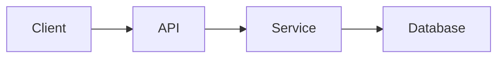

# TechSpec: {FEATURE_NAME}

| Field | Value |
|-------|-------|
| Status | Draft |
| Author | {AUTHOR} |
| Date | {DATE} |
| PRD | [1-PRD.md](./1-PRD.md) |

## 1. Overview

{Technical summary of the solution in one paragraph. Which approach was chosen and why.}

## 2. Architecture

{Describe the solution design. Include a diagram when it adds clarity.}



## 3. Components

| Component | Responsibility | Type |
|-----------|----------------|------|
| {Component} | {Single responsibility} | {New / Modified} |

## 4. Data Model

### Entities

| Entity | Field | Type | Constraints |
|--------|-------|------|-------------|
| {Entity} | {field} | {type} | {required, unique, indexed} |

### Migrations

- {Schema change and rollback strategy}

## 5. API Contracts

### {METHOD} {/path}

- Purpose: {what it does}
- Authorization: {required role or policy}

Request:

```json
{}
```

Response `200`:

```json
{}
```

Errors:

| Status | Condition |
|--------|-----------|
| 400 | {validation failure} |
| 404 | {resource not found} |

## 6. Business Rules

| ID | Rule | Source |
|----|------|--------|
| BR-01 | {Rule enforced by the domain} | FR-01 |

## 7. Requirement Traceability

| PRD Requirement | Technical Solution |
|-----------------|--------------------|
| FR-01 | {Component / endpoint / rule that satisfies it} |
| NFR-01 | {How it is guaranteed} |

## 8. Alternatives Considered

| Alternative | Pros | Cons | Decision |
|-------------|------|------|----------|
| {Option A} | {pros} | {cons} | Chosen |
| {Option B} | {pros} | {cons} | Rejected: {reason} |

## 9. Security

- Authentication: {mechanism}
- Authorization: {rules}
- Input validation: {strategy at the boundary}
- Sensitive data: {encryption, masking, retention}

## 10. Observability

- Logs: {what is logged and at which level}
- Metrics: {what is measured}
- Alerts: {conditions that trigger alerts}

## 11. Performance

- Expected load: {requests per second, data volume}
- Strategy: {caching, indexing, pagination, async processing}

## 12. Testing Strategy

| Level | Scope | Tooling |
|-------|-------|---------|
| Unit | {domain rules, services} | {framework} |
| Integration | {API, database} | {framework} |
| End To End | {critical flows} | {framework} |

## 13. Rollout

- Feature flag: {yes/no, flag name}
- Deployment order: {steps}
- Rollback plan: {how to revert safely}

## 14. Risks

| Risk | Probability | Impact | Mitigation |
|------|-------------|--------|------------|
| {Risk} | {Low/Medium/High} | {Low/Medium/High} | {Action} |

## 15. Open Questions

| # | Question | Owner | Resolution |
|---|----------|-------|------------|
| 1 | {OPEN QUESTION} | {Owner} | {Pending} |

## 16. Approval

| Role | Name | Decision | Date |
|------|------|----------|------|
| Tech Lead | {Name} | Pending | |
| Architecture | {Name} | Pending | |
