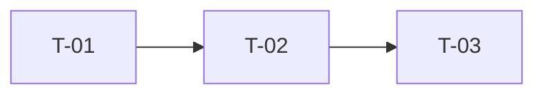

# Plan: {FEATURE_NAME}

| Field | Value |
|-------|-------|
| Status | Draft |
| Author | {AUTHOR} |
| Date | {DATE} |
| TechSpec | [2-TECHSPEC.md](./2-TECHSPEC.md) |

## 1. Strategy

{How the work will be sliced: vertical slices, incremental delivery, order rationale. Each task must be small, independent, and verifiable.}

## 2. Milestones

| Milestone | Deliverable | Tasks |
|-----------|-------------|-------|
| M1 | {Working increment} | T-01, T-02 |
| M2 | {Working increment} | T-03, T-04 |

## 3. Tasks

### T-01: {Task title}

- Description: {what to implement}
- Traceability: {FR-xx / BR-xx / NFR-xx}
- Files: {files to create or modify}
- Depends on: {none or T-xx}
- Definition of done:
  - [ ] {Verifiable condition}
  - [ ] Unit tests covering all scenarios
  - [ ] No lint or build errors

### T-02: {Task title}

- Description: {what to implement}
- Traceability: {FR-xx / BR-xx / NFR-xx}
- Files: {files to create or modify}
- Depends on: {none or T-xx}
- Definition of done:
  - [ ] {Verifiable condition}
  - [ ] Unit tests covering all scenarios
  - [ ] No lint or build errors

## 4. Task Order

## 5. Coverage Check

| TechSpec Item | Covered By |
|---------------|------------|
| {Component / endpoint / rule} | T-xx |

Every TechSpec component must map to at least one task. No task may exist without traceability.

## 6. Out Of Plan

- {Work intentionally deferred, with reason}

## 7. Approval

| Role | Name | Decision | Date |
|------|------|----------|------|
| Tech Lead | {Name} | Pending | |
